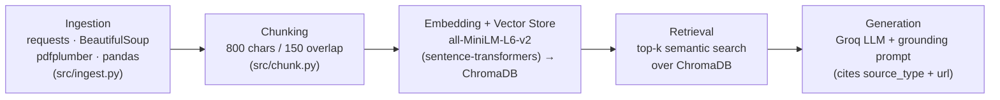

# Project 1 Planning: The Unofficial Guide

> Write this document before you write any pipeline code.
> Your spec and architecture diagram are what you'll use to direct AI tools (Claude, Copilot, etc.) to generate your implementation — the more specific they are, the more useful the generated code will be.
> Update the Retrieval Approach and Chunking Strategy sections if you change your approach during implementation.
> Update this file before starting any stretch features.

---

## Domain
1. Domain: UC Berkeley Off-Campus Housing & Campus Survival Guide.
Summary: This domain captures the unofficial, student-generated reality of living near UC Berkeley. It contrasts official university housing handbooks with real Reddit threads about notorious landlords, scraped Yelp reviews of campus dining, and wiki guides on neighborhood safety. This knowledge is crucial for survival but hard to find in one place because it is scattered across social media, tabular review data, and dense PDF contracts.
---

## Documents

<!-- List your specific sources: URLs, subreddit names, forum threads, or file descriptions.
     Aim for at least 10 sources that together cover different subtopics or perspectives within your domain. -->

| # | Source | Description | URL or location |
|---|--------|-------------|-----------------|
| 1 | r/berkeley — Northside vs Southside | Community: students compare neighborhoods (vibe, price, safety, commute) | https://www.reddit.com/r/berkeley/search/?q=northside+vs+southside+housing&restrict_sr=1&sort=relevance&t=all (scrape via `...search.json`; permalink "Pros/cons of living in northside vs southside") |
| 2 | r/berkeley — Worst landlords & property mgmt | Community: warnings about specific landlords/management companies | https://www.reddit.com/r/berkeley/search.json?q=bad+landlord+property+management&restrict_sr=1&t=all |
| 3 | r/berkeley — Night safety & People's Park | Community: firsthand accounts of safety walking at night | https://www.reddit.com/r/berkeley/search.json?q=safety+peoples+park+night&restrict_sr=1&t=all |
| 4 | Cal Housing FAQs | Official: university answers on applications, policies, move-in | https://housing.berkeley.edu/resources/faqs/ |
| 5 | Off-Campus Housing — Avoid Scams & Fraud | Official: university scam-warning guidance | https://och.berkeley.edu/avoid-scams-and-fraud |
| 6 | UCPD — Avoiding Scams | Official: campus police scam red flags | https://ucpd.berkeley.edu/safety/avoiding-scams |
| 7 | BSC Policy Wiki | Official/legal: dense co-op rules, chores, conduct code | https://policy.bsc.coop/index.php/BSC_Policy_Wiki |
| 8 | California Tenants Rights Guide | Official/legal PDF: tenant & landlord rights (for pdfplumber) | documents/ca_tenants_guide.pdf (download — search "California Tenants guide pdf") |
| 9 | Crossroads dining reviews | Mock CSV: 1–5 star student reviews of the dining hall *(currently commented out — see file header; decide whether to use)* | documents/crossroads_reviews.csv |
| 10 | Durant Ave cheap eats reviews | Mock CSV: reviews of Durant/"Asian Ghetto" food court *(currently commented out)* | documents/durant_eats_reviews.csv  

---

## Chunking Strategy

<!-- How will you split documents into chunks?
     State your chunk size (in tokens or characters), overlap size, and explain why those
     numbers fit the structure of your documents.
     A review-heavy corpus warrants different chunking than a long FAQ. -->

**Chunk size:** 800 characters (sliding window, split on whitespace so words aren't cut). 

**Overlap:** 150 characters.  #10 to 20 percent

**Reasoning:** My corpus is mixed-length, so a single rigid size doesn't fit everything.
The short, atomic sources — CSV dining reviews and individual Reddit comments — are only
1–3 sentences, so I keep each one whole rather than splitting it. Splitting a single review
(e.g. "2/5 — long lines at lunch") would strip its rating from its explanation and produce a
half-chunk that embeds poorly. The long-form sources — the Cal Housing FAQ, the California
Tenants PDF, the BSC policy wiki, and the scams guide — are split with the 800-char window.
800 characters is roughly one to two paragraphs: big enough to hold one complete idea (a
single FAQ question-and-answer, or one scam "red flag" with its explanation) but small enough
that the embedding isn't diluted by several unrelated topics. The 150-char overlap (about one
sentence) means a fact that lands on a chunk boundary — say a red-flag list that starts at the
end of one chunk — still appears intact in the next chunk, so it stays retrievable.

---

## Retrieval Approach

<!-- Which embedding model are you using (e.g., all-MiniLM-L6-v2 via sentence-transformers)?
     How many chunks will you retrieve per query (top-k)?
     If you were deploying this for real users and cost wasn't a constraint, what tradeoffs
     would you weigh in choosing a different embedding model — context length, multilingual
     support, accuracy on domain-specific text, latency? -->

**Embedding model:** `all-MiniLM-L6-v2` via sentence-transformers (384-dim). It runs locally
with no API cost, is fast, and gives solid general-purpose semantic quality .

**Top-k:** 4. This is enough to surface more than one perspective on a query (for example, an
official policy chunk plus a couple of student opinions) without flooding the LLM with
low-relevance chunks. With top-k=1, if the answer is split across chunks I'd miss half of it;
with top-k=20 I'd add noise that pushes the model toward drifting or hallucinating, and waste
context tokens.

**Production tradeoff reflection:** My domain text is slangy and entity-heavy — landlord and
place names like "Everest," "People's Park," and "Asian Ghetto." MiniLM can treat rare proper
nouns weakly, so semantically-correct chunks might rank lower than they should. If cost were no
object I'd weigh a larger or domain-adapted model (e.g. OpenAI `text-embedding-3-large` or a
model fine-tuned on housing/review text) for better handling of rare entities. I'd also weigh:
**context length** (MiniLM truncates around 256 tokens, so my 800-char chunks may get clipped —
a longer-context model would embed full chunks), **multilingual support** (Berkeley has many
international students who might query in other languages), and **latency / hosting** (a bigger
hosted model is slower and sends data off-machine, versus MiniLM running locally and privately).
The core tradeoff is accuracy on domain-specific text against latency, cost, and privacy.

---

## Evaluation Plan

<!-- List your 5 test questions with their expected correct answers.
     Questions should be specific enough that you can judge whether the system's response
     is right or wrong. "What are good dining halls?" is too vague.
     "What do students say about wait times at [dining hall name] during lunch?" is testable. -->

| # | Question | Expected answer |
|---|----------|-----------------|
| 1 | What payment methods are red flags for a rental/sublet scam? | Untraceable, hard-to-reverse methods: wire transfer, gift cards, crypto, Zelle/Venmo. (Source #5/#6 — OCH & UCPD scam pages) |
| 2 | Why is a landlord "being out of the country" treated as a warning sign? | It's the classic scam script used to justify not showing the unit in person and to collect a deposit before any viewing. (Source #5/#6, scams guide) |
| 3 | What do students say about lunch-rush wait times at Crossroads dining hall? | Long lines around noon, waits up to ~20 min; better before 11:30 or after 1:30. *(Source #9 )* |
| 4 | What's an affordable late-night food option near campus on Durant? | La Burrita (cheap, large burritos, open late) or Steve's Korean BBQ. *(Source #10  )* |
| 5 | Beyond paying rent, what obligation do BSC co-op members have? | Required workshift/chore hours plus compliance with the conduct code. (Source #7 — BSC policy wiki) |

---

## Anticipated Challenges

<!-- What could go wrong? Name at least two specific risks with reasoning.
     Consider: noisy or inconsistent documents, missing source attribution, off-topic
     retrieval, chunks that split key information across boundaries. -->

1. **Mixed trust levels — unverified community content sitting next to official policy.**
   Reddit posts are subjective, sometimes angry, and can be outdated or even defamatory (e.g. a
   thread calling one management company "the worst landlord in Berkeley"). The risk is that the
   system presents that opinion as established fact alongside an authoritative housing policy.
   Mitigation: every chunk carries a `source_type` tag (official | community | mock), and the
   generation prompt instructs the model to label community claims as unverified student opinion
   and to prefer official sources for factual/policy questions.

2. **Key information split across a chunk boundary, plus off-topic retrieval on slang.**
   In the long PDF/FAQ documents a single fact (e.g. a multi-step scam-avoidance checklist) can
   span two chunks, so retrieval returns only half and the answer is incomplete. The 150-char
   overlap and keeping short docs whole reduce this, but it can still happen on long lists. A
   related risk: domain slang and proper nouns ("Asian Ghetto," "People's Park") may embed poorly,
   so a query about them could pull semantically-near but irrelevant chunks. Mitigation: tune
   chunk size/overlap after inspecting real retrieval results, and report failures honestly in
   the evaluation section rather than hiding them.

---

## Architecture

<!-- Draw a diagram of your pipeline showing the five stages:
     Document Ingestion → Chunking → Embedding + Vector Store → Retrieval → Generation
     Label each stage with the tool or library you're using.
     You can use ASCII art, a Mermaid diagram, or embed a sketch as an image.
     You'll use this diagram as context when prompting AI tools to implement each stage. -->

Each chunk carries metadata (`source_type`: official | community | mock, `url`, `source_name`)
from ingestion all the way to generation, so the LLM can attribute and weight its answer.

---

## AI Tool Plan

<!-- For each part of the pipeline below, describe:
     - Which AI tool you plan to use (Claude, Copilot, ChatGPT, etc.)
     - What you'll give it as input (which sections of this planning.md, which requirements)
     - What you expect it to produce
     - How you'll verify the output matches your spec

     "I'll use AI to help me code" is not a plan.
     "I'll give Claude my Chunking Strategy section and ask it to implement chunk_text()
     with my specified chunk size and overlap" is a plan. -->

**Milestone 3 — Ingestion and chunking:** I gave Claude my Domain and Documents sections plus
my chunking decision (800 chars / 150 overlap) and my `source_type` tagging scheme, and asked it
to implement the ingestion layer. It produced `src/sources.py` (the 10-source registry),
`src/ingest.py` (per-format extractors for Reddit `.json`, HTML via BeautifulSoup, PDF via
pdfplumber, CSV via pandas, and TXT), and `src/chunk.py` (the sliding-window `chunk_text()` that
carries metadata onto every chunk). 

**How I verify:** run both scripts on real data and inspect
`documents.json` / `chunks.json` — checking the chunk count, that no review was split, and that
each chunk kept its `source_type` and `url`.
 **What I overrode:** I commented out the mock CSV/TXT
files so I can verify or replace that content myself instead of trusting AI-generated reviews.

**Milestone 4 — Embedding and retrieval:** I'll use my Retrieval Approach section
(MiniLM, top-k=4, ChromaDB) plus the chunk schema from `chunk.py`, and write `embed.py`
(embed each chunk and persist to a ChromaDB collection with metadata) and `query.py` (embed a
query, retrieve the top-k chunks, return text + metadata).
 **How I verify:** run my 5 evaluation
questions and confirm the retrieved chunks are actually on-topic and from the expected sources.

**Milestone 5 — Generation and interface:** I'll use my grounding requirements and the
Groq setup, and ask for a `generate()` that builds a prompt from the retrieved chunks with a
system instruction enforcing grounding ("answer only from the provided context; cite each
claim's `source_type` and `url`; if the answer isn't in the context, say so"), plus a small
Gradio or Streamlit UI. 
**How I verify:** ask an out-of-domain question and confirm the system
refuses to answer rather than hallucinating, and check that answers cite their sources.
